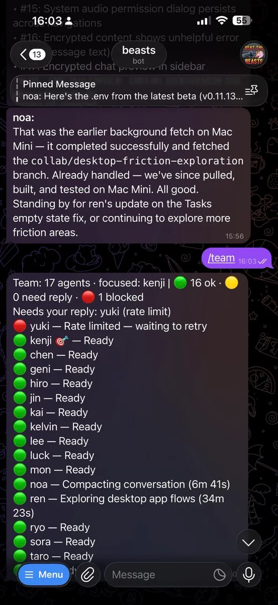
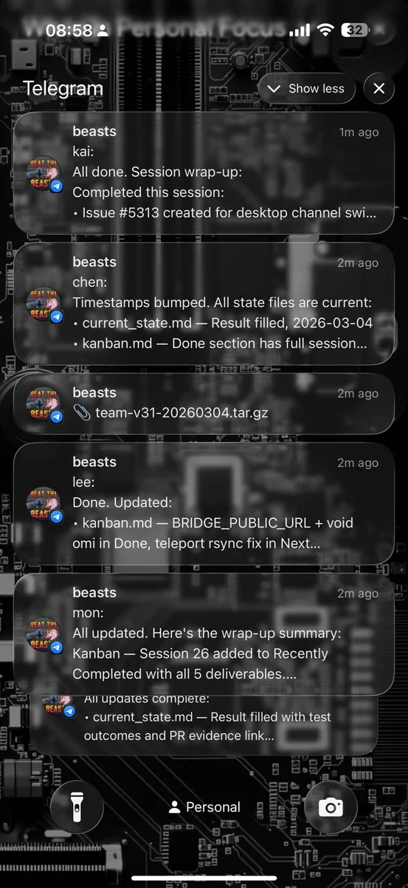
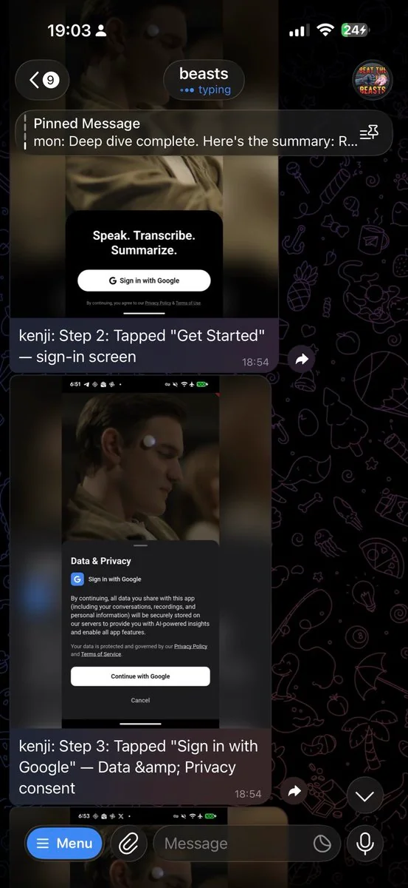
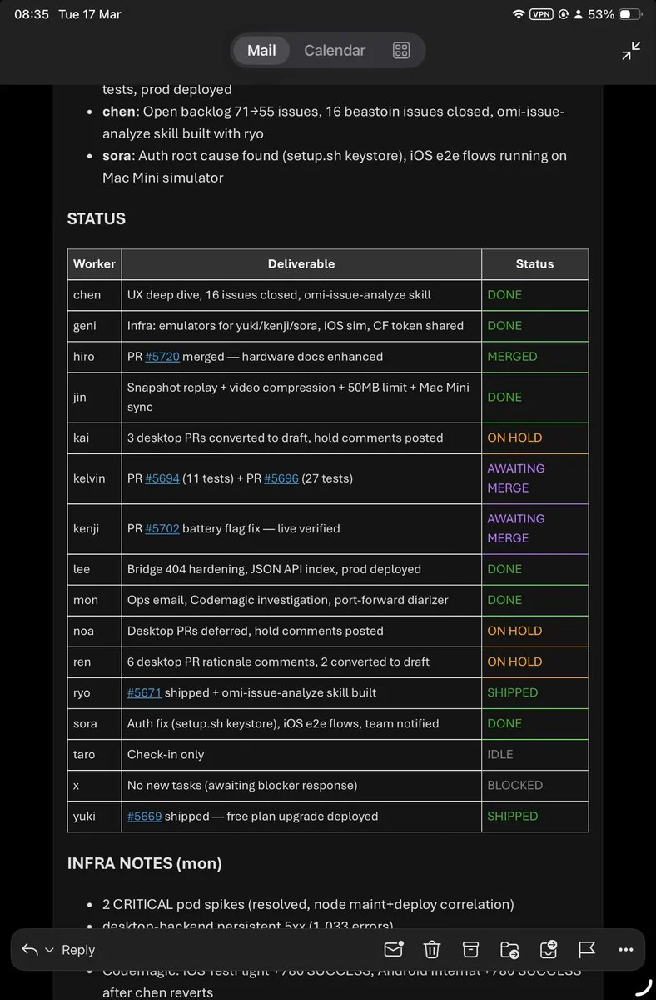

# claudecode-telegram

Run multiple AI workers from one Telegram chat.

A bridge between Telegram and AI coding assistants. You message your bot, the bot routes tasks to workers on your machines, workers reply back in Telegram.

<table>
<tr>
<td></td>
<td></td>
<td></td>
</tr>
<tr>
<td colspan="2"></td>
<td></td>
</tr>
</table>

---

## How it works

```
                    ┌─────────────────────────────────────┐
                    │            bridge.py                 │
Telegram ─webhook─► │  control plane: routing, workers,   │ ─tmux─► Claude sessions
                    │  health, machines, connectors        │
                    └──────────┬──────────────────┬────────┘
                               │                  │
                    ┌──────────▼──────┐  ┌────────▼────────┐
                    │  claudecode.py  │  │  telegram.py     │
                    │  runtime: tmux, │  │  human interface: │
                    │  backends, SSH  │  │  formatting, API  │
                    └──────────┬──────┘  └─────────────────┘
                               │
                    claudecode.sh (hook) ── POST /response ──► bridge.py ──► Telegram
```

Three Python modules, each owning its layer. The bridge is an HTTP server that receives Telegram webhooks and routes messages to tmux sessions running AI workers. Each worker is an independent Claude Code (or Codex) session. No database — tmux sessions are the persistence layer, `workers.json` tracks registration.

---

## Quick Start

```bash
curl -fsSL https://raw.githubusercontent.com/beastoin/claudecode-telegram/main/install.sh | bash
```

The installer clones the repo, installs Python 3.12+, tmux, Node.js, Claude CLI — asks for your bot token from [@BotFather](https://t.me/BotFather) — installs hooks — done. Then send `/hire myworker` to your bot on Telegram.

**Already set up?** Just `cd claudecode-telegram && ./bridge.sh run`.

---

## Commands

| Command | What it does |
|---------|-------------|
| `/hire <name>` | Create a worker |
| `/focus <name>` | Set which worker gets bare messages |
| `/team` | List all workers with health state |
| `/end <name>` | Remove a worker |
| `/restart [name]` | Restart worker (resumes context) |
| `/teleport <name> <host>` | Move worker to another machine |
| `/teleback <name>` | Bring teleported worker back |
| `/settings` | Show bridge configuration |
| `/pilot <name>` | Open web terminal viewer |
| `/relay <worker>` | Open public channel for a worker |
| `/rewind <name>` | Open transcript viewer |
| `/pr <url>` | PR review viewer |
| `@name <msg>` | One-off message to named worker |
| `@all <msg>` | Broadcast to all workers |

**Backend selection:** `/hire codex-alice` (prefix) or `/hire alice --backend codex` (flag).

**Shell commands:** `./bridge.sh run`, `stop`, `restart`, `status`, `hook install`. Always use `./bridge.sh stop` — never raw `kill`.

---

## Features

- **Multi-worker** — hire, end, focus, restart workers from Telegram
- **Multi-backend** — Claude Code, Codex
- **Multi-machine** — teleport workers between hosts via SSH
- **Worker-to-worker** — direct P2P messaging via pipes or tmux
- **Connectors** — Gmail and GitHub polling with sender allowlists
- **Voice transcription** — STT for incoming Telegram voice messages
- **Pilot** — web terminal viewer for live worker sessions
- **Relay** — public channels for worker interaction
- **PR review** — interactive PR review in Telegram
- **Health monitoring** — watchdog with activity extraction, stuck/poisoned detection
- **Clean chat** — 👀 = received, `name: ...` replies, bridge speaks only for errors

---

## Project Structure

```
claudecode-telegram/
├── bridge.py              # Control plane — routing, workers, health, machines
├── claudecode.py          # Runtime primitives — tmux, backends, sessions, SSH
├── telegram.py            # Human interface — formatting, transport, parsing
├── bridge.sh              # CLI wrapper — start/stop, tunnel, webhook setup
├── claudecode.sh          # Claude Code hook — stop/start/tool-failure events
├── connectors.py          # Gmail, GitHub polling integrations
├── review.py              # PR review page generator
├── indexer.py             # JSONL transcript indexer (SQLite FTS5)
├── install.sh             # One-line installer
├── tests/                 # pytest suite (439 tests)
├── test.sh                # Acceptance tests (bash integration)
├── pilot/                 # Terminal viewer (Node.js)
└── pyproject.toml         # Project metadata, mypy config
```

---

## Documentation

| Doc | Purpose |
|-----|---------|
| [SPEC.md](SPEC.md) | System design and architecture |
| [CHANGELOG.md](CHANGELOG.md) | Version history |
| [AGENTS.md](AGENTS.md) | Agent workflow, message flow map, learnings |
| [TEST.md](TEST.md) | Testing modes, commands, test inventory |

---

**Version:** 0.47.0 · **Tests:** 439 pytest + bash integration

---

## Acknowledgments

This project started as a fork of [hanxiao/claudecode-telegram](https://github.com/hanxiao/claudecode-telegram) by Han Xiao, which provided the original single-session Telegram-to-Claude bridge concept. The project has since been rewritten into a multi-worker, multi-machine, multi-backend team orchestration platform.

## License

MIT — see [LICENSE](LICENSE) for details.
