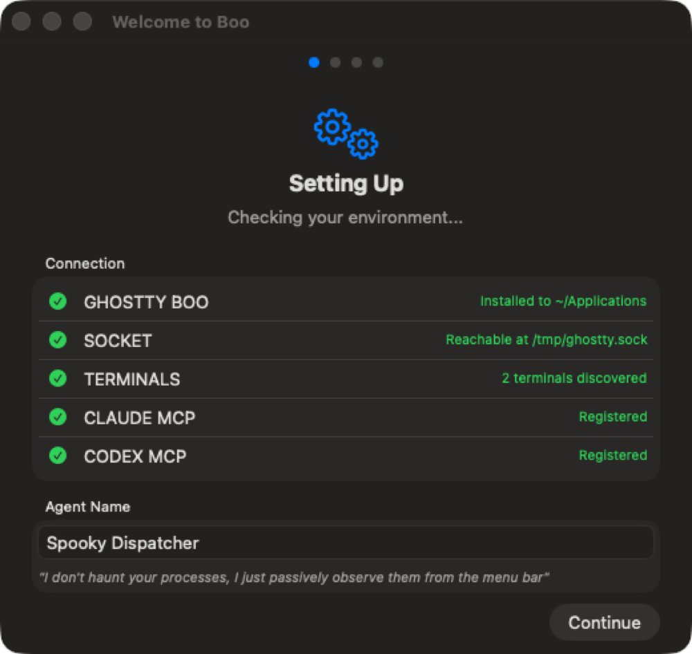
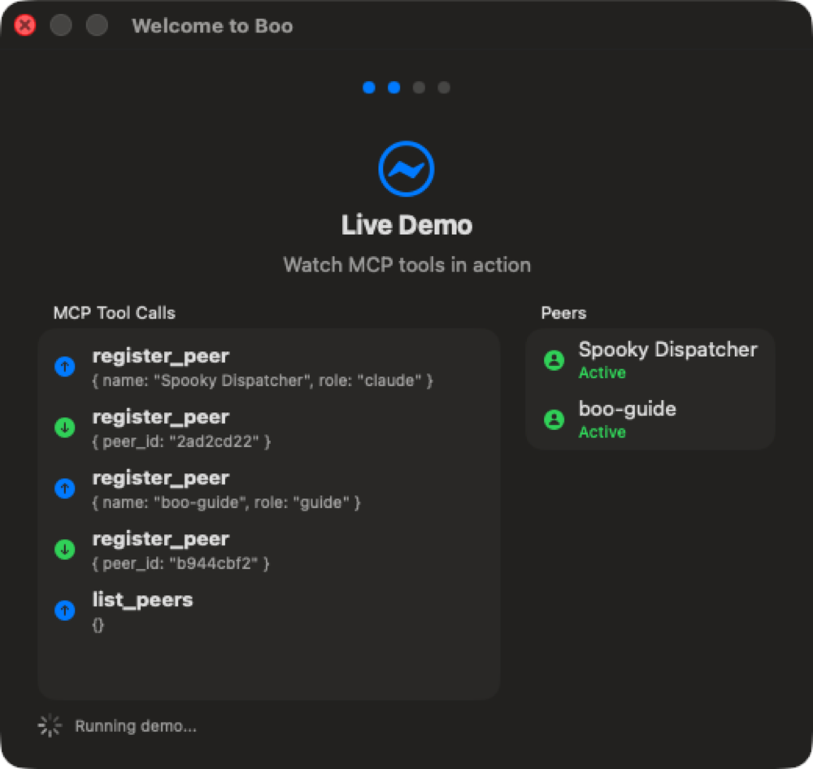
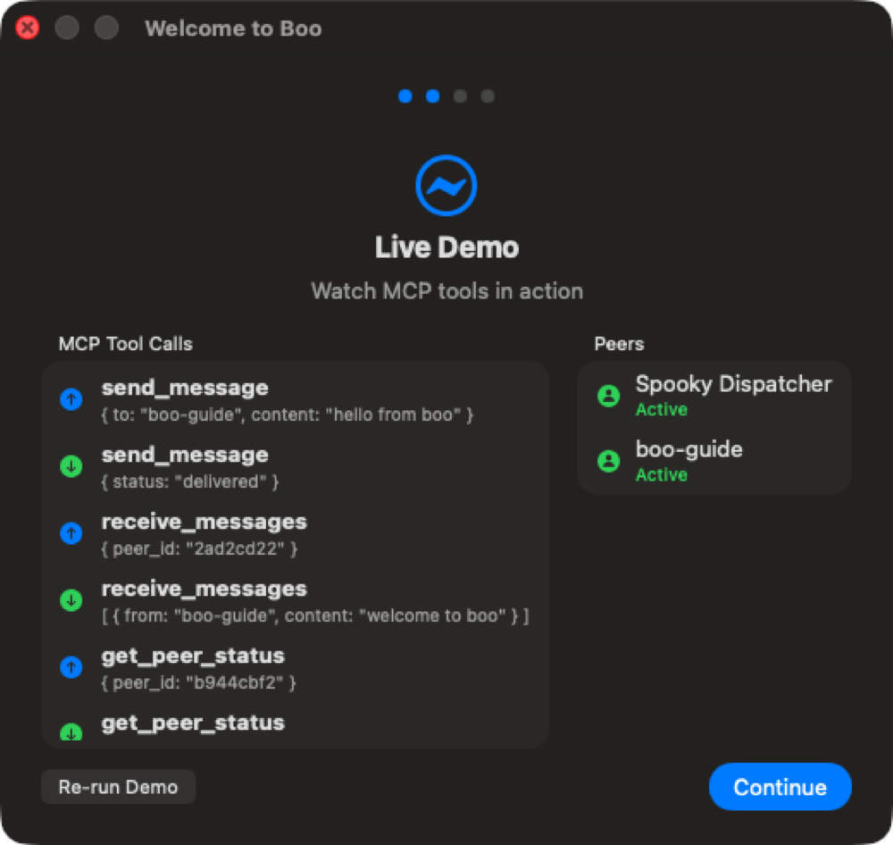
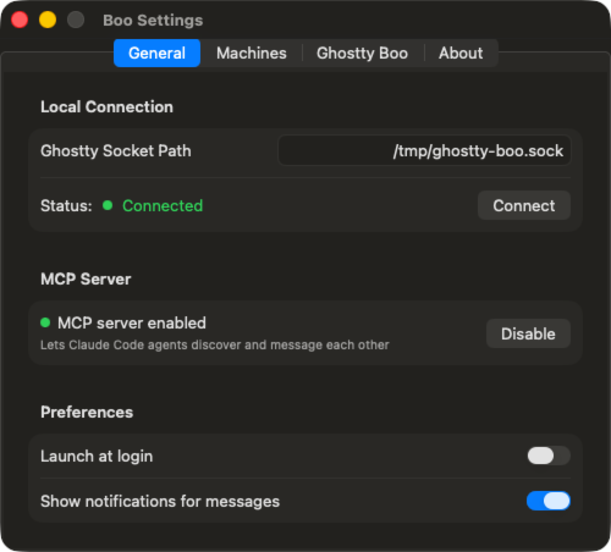
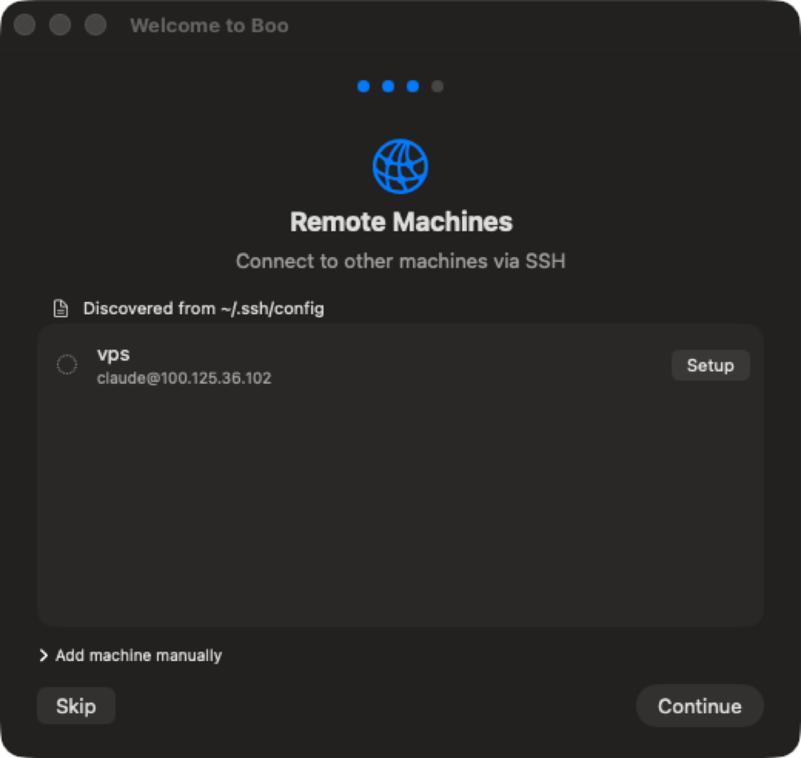
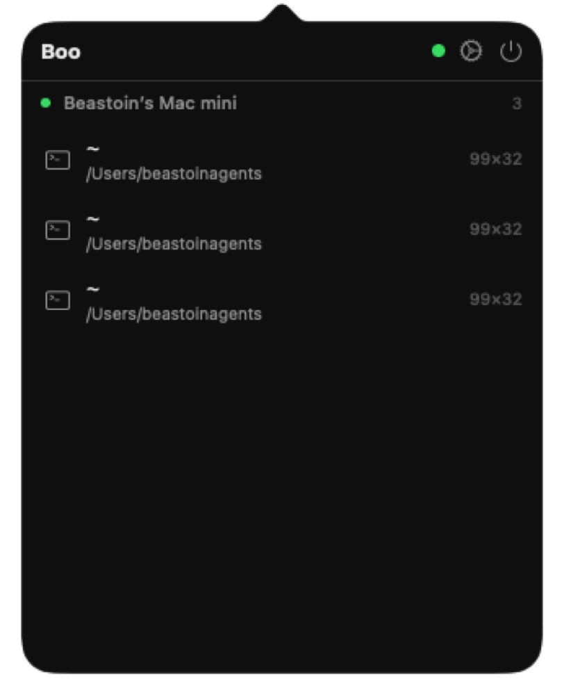
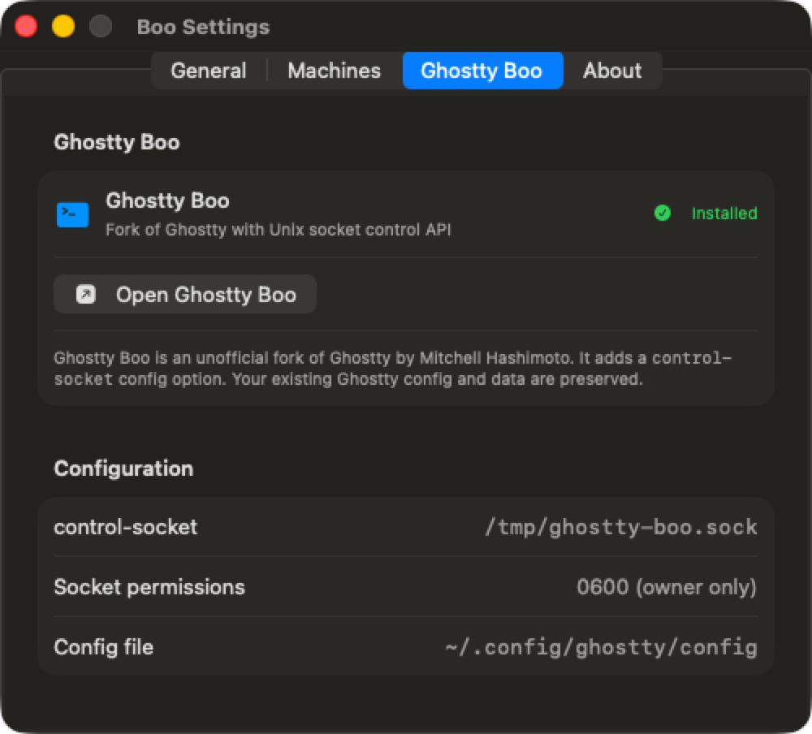
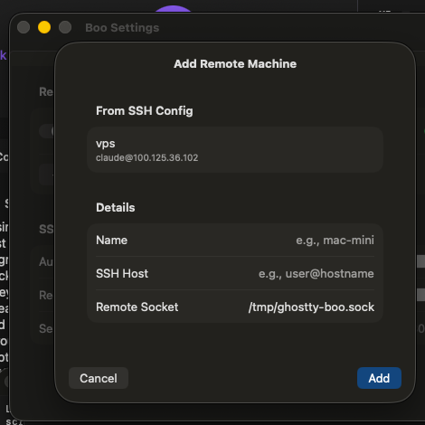
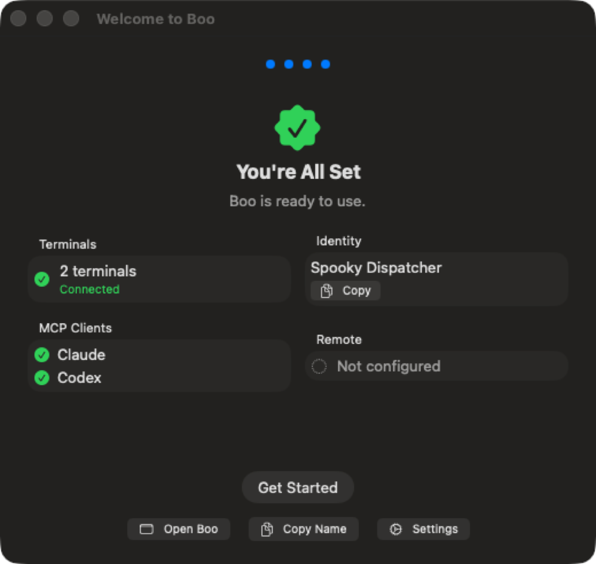

# Boo v0.2.4 Evidence: Manager Feedback Fixes

All 9 feedback items from manager review of v0.2.3, implemented in commit `607b0a4`.

---

## Fix 1: Auto-create panels without manual Ghostty Boo window/panel creation

**Before:** User had to manually open Ghostty Boo and create a window before the demo could run.
**After:** OnboardingDemoEngine auto-creates a window via AppleScript (Cmd+N) if Ghostty Boo is running but has no terminals. OnboardingCoordinator also auto-launches Ghostty Boo if installed but not running.

**Files changed:** `OnboardingDemoEngine.swift`, `OnboardingCoordinator.swift`

---

## Fix 2: Show Continue button after Live Demo success

**Before:** Continue button was not visible/prominent after demo completed.
**After:** Demo success state shows a prominent blue "Continue" button (bottom-right) with a smaller "Re-run Demo" option on the left.

**Files changed:** `FirstContactView.swift`

---

## Fix 3: Socket path should be `/tmp/ghostty-boo.sock`

**Before:** Socket path defaulted to `/tmp/ghostty.sock`.
**After:** All socket path references updated to `/tmp/ghostty-boo.sock`.

**Files changed:** `GhosttyBooInstaller.swift`, `SetupDetector.swift`, `MCPServer.swift`, `RemoteProvisioner.swift`, `OnboardingCoordinator.swift`, `AppDelegate.swift`, `SettingsView.swift`, `OnboardingDemoEngine.swift`

---

## Fix 4: SSH host list should be scrollable

**Before:** SSH host list could overflow the window with many hosts.
**After:** SSH host list wrapped in ScrollView with max height of 200pt.

**Files changed:** `RemoteLinkView.swift`

---

## Fix 5: Remove refresh button, auto-refresh every 15s + immediately on popover open

**Before:** Popover had a manual refresh button.
**After:** Refresh button removed. Auto-refreshes immediately when popover opens and every 15 seconds while open. Timer invalidated on close.

**Files changed:** `PopoverView.swift`

---

## Fix 6: Click agent/terminal row to open and focus Ghostty Boo panel

**Before:** Terminal rows were display-only.
**After:** Tapping a terminal row runs AppleScript to bring Ghostty Boo to the foreground.

**Files changed:** `PopoverView.swift` (TerminalRow)

---

## Fix 7: Rename "Installer" tab to "Ghostty Boo"

**Before:** Settings tab was labeled "Installer".
**After:** Tab renamed to "Ghostty Boo".

**Files changed:** `SettingsView.swift`

---

## Fix 8: Show warning in General tab if Ghostty Boo not installed

**Before:** No indication in General settings that Ghostty Boo was missing.
**After:** Orange warning banner at top of General tab when Ghostty Boo is not found, with link to the Ghostty Boo tab.

**Files changed:** `SettingsView.swift` (GeneralSettingsTab)

*Note: Warning not visible in screenshots because Ghostty Boo IS installed on this machine. The warning only appears when Ghostty Boo is not detected (correct behavior).*

---

## Fix 9: Add Machine should show SSH config hosts to select from

**Before:** Add Machine was a plain form with manual hostname entry.
**After:** Add Machine sheet has a "From SSH Config" section showing discovered hosts. Clicking a host pre-fills the Details form.

**Files changed:** `SettingsView.swift` (AddMachineSheet)

---

## Onboarding Flow (complete walkthrough)

1. **Boot** - Probes run and all pass automatically
2. **Demo** - Live MCP tool calls with real Ghostty terminals
3. **Remote** - SSH hosts discovered and displayed
4. **Ready** - Summary with "Get Started"

